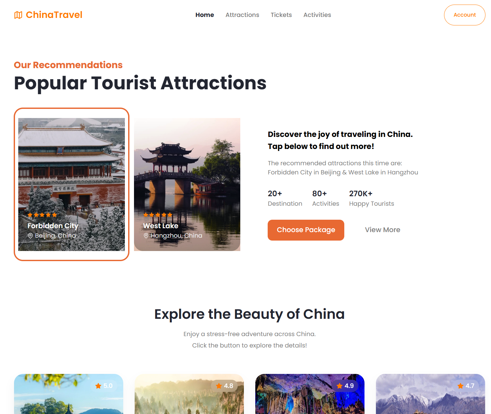

# China Travel Technical Report

## 1. PWA Technology Feature Description

Progressive Web App (PWA) is a modern web application that combines the advantages of both web and native applications. PWA core technologies include:

- **Service Worker**: Scripts that run in the browser background, enabling offline caching and content preloading
- **Web App Manifest**: A JSON file that defines the installation and display behavior of the application
- **HTTPS**: Encrypted transmission protocol ensuring application security
- **Responsive Design**: Layout technology that adapts to different device screens

The main advantages of PWA include:
- Installation without an app store
- Support for offline operation
- Fast loading and response
- Push notification capabilities
- Cross-platform compatibility

## 2. Project Introduction

### Project Goals and Core Features

China Travel is a China tourism destination exploration application developed with Next.js, designed to provide users with information and booking services for tourist attractions across China. Core features include:

- Browsing famous tourist attractions across China
- Viewing detailed information and images of attractions
- User account management and travel booking
- Offline access to basic content
- Providing native app-like user experience

### Technology Stack Justification

#### PWA as Core Technology

This project chose PWA as its core technology feature based on the following considerations:

1. **Enhanced User Experience**: Through PWA technology, users can add the application to their home screen and enjoy a native app-like experience without downloading from an app store.

2. **Offline Functionality Requirement**: In travel application scenarios, users may use the app in environments with unstable networks. PWA's offline capability ensures users can still access basic content without an internet connection.

3. **Cross-Platform Compatibility**: PWA can run in any modern browser, without platform limitations, allowing the application to reach a broader user base.

#### Choice of Next.js Framework

While the course module does not specifically cover Next.js, this framework was selected for the following pragmatic reasons:

1. **PWA Implementation Simplicity**: Next.js offers streamlined PWA integration through the next-pwa plugin, significantly reducing the complexity of Service Worker configuration and management.

2. **Performance Optimization**: The framework's built-in image optimization, code splitting, and server-side rendering capabilities directly enhance PWA performance metrics, particularly on mobile devices.

3. **Development Efficiency**: Next.js's file-based routing system and integrated API routes enabled faster development of the application's core features, allowing more focus on implementing the required PWA and device API functionality.

4. **Production Readiness**: The framework provides production-optimized builds with minimal configuration, ensuring the application can be easily deployed and maintained.

It's important to note that while Next.js was used as the development framework, the core educational focus remains on implementing and understanding PWA technology and device API integration, which are framework-agnostic concepts.

### Positive Impact of the Technology

PWA technology has had the following positive impacts on the project:

- **Improved User Retention**: Through home screen icons and offline functionality, users are more likely to revisit the application
- **Performance Optimization**: Service Worker caching strategies significantly improve page loading speed and responsiveness
- **Reduced Development Costs**: Compared to native app development, PWA reduces platform-specific adaptation work
- **Enhanced User Experience**: Provides an immersive experience similar to native applications

## 3. System Architecture and Functional Module Analysis

### Overall System Architecture

China Travel is built using a modern frontend technology stack, with the architecture based on the PWA (Progressive Web App) principles. The system follows a component-based architecture with clear separation of concerns between the UI, business logic, and data persistence layers.

<div style="display: flex; justify-content: space-between; margin-bottom: 20px;">
  <div style="flex: 1; margin-right: 10px;">
    
    <p style="text-align: center;"><em>Figure 1: System Architecture Diagram</em></p>
  </div>
  <div style="flex: 1; margin-left: 10px;">
    
    <p style="text-align: center;"><em>Figure 2: Functional Module Diagram</em></p>
  </div>
</div>

The project implements the **Atomic Design** methodology for its component structure. This is a systematic methodology that breaks down interfaces into fundamental building blocks and then combines them to form more complex components:

- **Atoms**: The smallest building blocks of the interface (buttons, inputs, icons, etc.)
- **Molecules**: Groups of atoms functioning together as a unit (form controls, cards, etc.)
- **Organisms**: Complex UI components composed of groups of molecules and atoms (navigation bars, content sections, etc.)

This approach facilitates component reusability, maintains consistency across the application, and improves development efficiency. The component organization directly reflects this hierarchy in the project folder structure.

### Functional Module Description

The project's main functional modules include:

#### 1. Home Module
- Displays recommended/popular travel destinations
- Provides navigation to other main pages
- Implements responsive layout for different devices

#### 2. Attraction Detail Module
- Displays detailed descriptions, images, and prices of attractions
- Integrates maps to show attraction locations with geolocation data
- Provides booking functionality entry points

#### 3. Account Management Module
- User personal information management
- Booking history viewing
- Payment method management
- Camera API integration for user avatar photos

#### 4. PWA Core Module
- Service Worker configuration
- Web App Manifest settings
- Offline page and error handling
- Device API integration

### Hardware/Device API Integration

The application utilizes several device APIs to enhance the user experience:

#### 1. Geolocation API
The attraction detail pages leverage the browser's Geolocation API to:
- Display the current location of the user in relation to attractions
- Calculate distances between the user and points of interest
- Provide directions from the user's current location to attractions

```javascript
// Example of Geolocation API usage
const getUserLocation = () => {
  if (navigator.geolocation) {
    navigator.geolocation.getCurrentPosition(
      (position) => {
        const userCoordinates = {
          latitude: position.coords.latitude,
          longitude: position.coords.longitude
        };
        setUserLocation(userCoordinates);
      },
      (error) => {
        console.error('Error getting user location:', error);
      }
    );
  }
};
```

#### 2. Camera API
The application integrates with the device camera through the MediaDevices API:
- Users can take profile pictures directly within the app
- The camera interface is built into the account management page
- Images can be captured and stored as user avatars

```javascript
// Camera API integration example
const startCamera = async () => {
  try {
    const stream = await navigator.mediaDevices.getUserMedia({ video: true });
    if (videoRef.current) {
      videoRef.current.srcObject = stream;
      setCameraActive(true);
    }
  } catch (error) {
    console.error('Failed to access camera:', error);
    alert('Cannot access camera, please check permission settings');
  }
};
```

#### 3. Device Storage API
The application uses IndexedDB and localStorage APIs for:
- Storing user data for offline access
- Caching attraction information and images
- Persisting user preferences and settings

These hardware/device API integrations are essential components of the PWA functionality, enabling rich, native-like experiences while running in a browser environment.

### Technical Implementation Details

#### PWA Configuration Implementation

The core configuration of PWA is implemented through the `next-pwa` package in `next.config.js`:

```javascript
const withPWA = require('next-pwa')({
  dest: 'public',
  disable: process.env.NODE_ENV === 'development',
  register: true,
  skipWaiting: true,
})

const nextConfig = {}

module.exports = withPWA(nextConfig)
```

#### Offline Page Implementation

The offline page is an important component of PWA, providing a friendly prompt when users lose network connection:

```typescript
export default function OfflinePage() {
  return (
    <div className="flex min-h-screen flex-col items-center justify-center p-4 text-center">
      <div className="mb-8">
        <Logo isDisplayMobile />
      </div>
      <h1 className="mb-4 text-3xl font-bold">You are currently offline</h1>
      <p className="mb-8 max-w-md text-gray-600">
        It looks like your network connection is interrupted. Please check your network connection and try again.
        Some features may still be available in offline mode.
      </p>
      <Button asChild>
        <Link href="/" className="flex items-center gap-2">
          <ArrowLeft size={18} />
          Back to Home
        </Link>
      </Button>
    </div>
  );
}
```

#### Service Worker Caching Strategy

The Service Worker automatically generated by `next-pwa` implements the following caching strategies:

1. **Precaching Core Resources**: Core JS, CSS, and HTML files are cached in advance during the installation phase
2. **Image Resource Caching**: Uses Network First strategy, prioritizing retrieving the latest images from the network
3. **API Request Caching**: Uses Stale-While-Revalidate strategy, returning cached content first and then updating in the background
4. **Offline Page Fallback**: Automatically navigates to the offline page during network failures

#### Data Persistence and Offline Access

Using IndexedDB (via Dexie.js) to implement data persistence, supporting offline data access:

```typescript
// Database definition
class ChinaTravelDB extends Dexie {
  items!: Dexie.Table<VacationItemTypes, string>;
  bookings!: Dexie.Table<BookingDataTypes, string>;
  members!: Dexie.Table<MemberTypes, string>;
  payments!: Dexie.Table<PaymentTypes, string>;

  constructor() {
    super("ChinaTravelDB");

    this.version(1).stores({
      items: "id, title, city, country, unit, price, rating, description, image, sum_booking",
      bookings: "id, invoice, amount, total, item_id, member_id, payment_id",
      members: "id, first_name, last_name, email, phone_number",
      payments: "id, created_at, card_number, card_holder_name, cvc"
    });
  }
}
```

## 4. Step-by-Step Usage Guide

### Downloading and Running the Application

#### Clone the Repository

```bash
git clone https://github.com/zhechun683/chinatravel.git
cd chinatravel
```

#### Install Dependencies

```bash
npm install
```

#### Start Development Environment

```bash
npm run dev
```

The application will run at http://localhost:3000.

#### Build Production Version

```bash
npm run build
npm start
```

### Mobile Usage

China Travel has been fully optimized for mobile devices:

1. **Mobile Browser Access**
   - Visit the application URL in a mobile browser
   - The interface automatically adapts to the screen size
   - Use the bottom navigation for feature access

2. **PWA Installation Experience**
   - Click "Add to Home Screen" in supported browsers
   - Launch the application from your device's home screen for a full-screen experience
   - Enjoy offline access to core features

### GitHub Repository

The project code is publicly hosted on GitHub: https://github.com/zhechun683/chinatravel

### Application Screenshots

Below are screenshots showing the China Travel application on different devices:

<div style="display: flex; justify-content: space-between; margin-bottom: 20px;">
  <div style="flex: 1; margin-right: 10px;">
    
    <p style="text-align: center;"><em>Figure 3: Desktop Experience</em></p>
  </div>
  <div style="flex: 1; margin-left: 10px;">
    
    <p style="text-align: center;"><em>Figure 4: Mobile Experience</em></p>
  </div>
</div>

## 5. Conclusion, Recommendations, and Reflection

### Learning Outcomes

Through the development of this project, I gained the following key technologies and skills:

1. **PWA Development Practice**: Mastered Service Worker configuration, Web App Manifest settings, offline functionality implementation, and other core PWA technologies
2. **Next.js Application Development**: Deeply understood the working principles and best practices of server-side rendering frameworks based on React
3. **Client-side Data Persistence**: Learned to implement complex data storage and offline data access using IndexedDB
4. **Responsive Design**: Implemented responsive interfaces for various devices through Tailwind CSS

### Project Challenges and Solutions

During development, I encountered the following challenges and their respective solutions:

1. **Service Worker Debugging Complexity**
   - **Challenge**: Difficult to debug Service Worker lifecycle and caching behavior
   - **Solution**: Used Chrome DevTools' Application panel for debugging and implemented specific development environment disable logic

2. **Limited Mobile Device Testing Coverage**
   - **Challenge**: Difficult to test application behavior on all target mobile devices
   - **Solution**: Used Chrome DevTools' device emulation feature and BrowserStack for cross-device testing

3. **Offline Data Synchronization**
   - **Challenge**: Users need to synchronize with the server after modifying data in offline state
   - **Solution**: Implemented optimistic concurrency control strategy based on timestamps, coordinating data upon reconnection

### Improvement Suggestions

Directions for improvement in future similar projects:

1. **Performance Optimization**
   - Implement more precise Service Worker caching strategies
   - Optimize critical rendering path to improve first screen loading speed
   - Implement code splitting to reduce initial loading package size

2. **Feature Extensions**
   - Integrate push notification functionality to increase user engagement
   - Add Background Sync API to optimize offline data processing
   - Implement more complex offline functionality, such as offline booking and payment

3. **User Experience Enhancement**
   - Improve installation prompt mechanism to increase PWA installation conversion rate
   - Optimize offline user interface to provide richer offline interaction options
   - Implement progressive loading strategy, prioritizing critical content display

### Advantages and Limitations of Technology Features

#### PWA Technology Advantages

1. **Cross-Platform Compatibility**: One codebase adapts to multiple platforms, significantly reducing development and maintenance costs
2. **No App Store Required**: Direct installation from web pages simplifies distribution process and avoids app store review
3. **Automatic Updates**: Users always get the latest version, avoiding the fragmentation problem of traditional applications
4. **Progressive Experience Enhancement**: Provides progressive features based on device capabilities, balancing compatibility and advanced features

#### PWA Technology Limitations

1. **Limited iOS Support**: Apple's platform still has limitations on PWA support, some advanced features cannot be implemented
2. **Limited System Integration**: Compared to native applications, PWA still has limitations in accessing system APIs and hardware features
3. **User Awareness Challenge**: Many users are unfamiliar with the PWA installation process, affecting application promotion
4. **Insufficient Development Tools**: PWA development and debugging tools are still not as mature as the native application development ecosystem

In summary, PWA technology provides a strong technical foundation for the China Travel project, achieving the goals of cross-platform compatibility, offline access, and native-like experience. Despite some limitations, PWA technology's advantages clearly outweigh its disadvantages, offering a promising development path for travel applications.

In the future, as web standards evolve and browser support strengthens, PWA technology will further narrow the gap with native applications while maintaining its unique cross-platform and easy distribution advantages.

## 6. Academic Integrity and Reference Declaration

### Project References and Originality Statement

This China Travel project has referenced the following resources, which are hereby explicitly acknowledged:

1. **Basic Framework and Structure Reference**
   - The basic UI structure and component design of this project referenced the open-source project "Goout" (https://github.com/akmalseptiyana/goout.git)
   - Referenced content includes: basic page layout, component structure design, and UI organization
   - All referenced code has been substantially modified to adapt to the specific requirements and theme of this project

2. **UI Component Library Usage**
   - The project uses the open-source UI component library Radix UI (https://www.radix-ui.com/)
   - Components used include dialogs, dropdown menus, tabs, and switches among other basic UI elements
   - All components have been customized with styles to meet the project design requirements

### Original Contribution Statement

The following features and implementations are original contributions of this project:

1. **PWA Feature Extension and Implementation**
   - Offline functionality and Service Worker configuration are completely original implementations
   - PWA installation process and offline page are original designs and developments
   - All related Service Worker caching strategies are original designs

2. **Account Management System**
   - The complete implementation of the account module, including UI design and functional logic, is original
   - User information management and booking history features are original developments
   - Related data models and processing logic are original designs

3. **Device API Integration**
   - Geolocation API integration and implementation are original developments
   - Camera API integration and user avatar functionality are original implementations
   - These features do not exist in the referenced project and were developed entirely by this project's developer

4. **Offline Data Storage Solution**
   - Client-side data persistence solution using IndexedDB and Dexie.js is an original design
   - Data model design and synchronization strategy are original implementations
   - The complete architecture for offline data access is an original contribution

5. **China Tourism Theme Content**
   - All content related to Chinese tourism, attraction descriptions, and image selection are original
   - Localized design elements and interface adjustments are original contributions

6. **Navigation and Interactive Elements Implementation**
   - Custom implementation of interactive buttons and page navigation (such as "Book Now", "View More" buttons on the homepage)
   - Enhanced user flow and navigation paths between different application sections
   - Implementation of interactive elements with optimized mobile touch interactions
   - Custom animation and transition effects for improved user experience

### Technical Dependencies and Third-Party Libraries Declaration

This project uses the following open-source dependencies, which are hereby explicitly acknowledged:

1. **Framework and Core Libraries**
   - Next.js (https://nextjs.org/): React framework
   - React (https://reactjs.org/): UI library
   - TypeScript (https://www.typescriptlang.org/): Type checking tool

2. **UI and Styling**
   - Tailwind CSS (https://tailwindcss.com/): Utility-first CSS framework
   - Lucide React (https://lucide.dev/): Icon library
   - class-variance-authority & clsx: CSS class name handling tools

3. **Functional Extension Libraries**
   - next-pwa (https://github.com/shadowwalker/next-pwa): PWA support plugin
   - dexie.js (https://dexie.org/): IndexedDB wrapper library
   - leaflet & react-leaflet (https://leafletjs.com/): Interactive map library

4. **Development Tools**
   - ESLint & Prettier: Code quality and formatting tools
   - Sharp: Image processing library

All third-party libraries used are properly imported through the npm package manager and explicitly listed in package.json. The project complies with all relevant open-source license requirements.